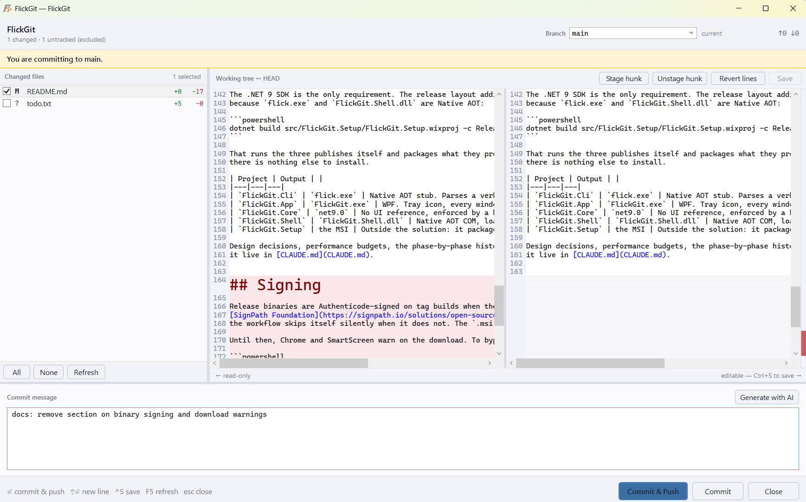

# ⚡ FlickGit

### Press one key, press Enter, it's committed and pushed — and the AI wrote the message.

A lightweight Git front-end for Windows, built for speed and wired straight into Explorer. Fast
commits and fast Git actions from a keyboard shortcut or a right-click, with branches, worktrees,
tags and stashes managed seamlessly in one window each.

For developers who work across many repositories, want to be fast with Git, and would rather not
spend their day in a Git client at all.

*Windows 10 / 11 · per-user install, no administrator rights · Apache 2.0*


## What it looks like

**The Explorer context menu** — one click from wherever you already are, with the current branch
in the label:


**The commit window** — file list with line counts, a live-editable side-by-side diff, and an AI
message streaming in while you look:




## The fast path

1. **`Ctrl+Alt+G`** while an Explorer window is in front — the commit window opens on that
   repository, caret already in the message box.
2. The AI commit message streams in. Or type your own.
3. **`Enter`** commits and pushes.

Press Enter before the message arrives and the commit is queued — it fires the moment it lands.
`Ctrl+Alt+R` opens the repository palette instead, listing the repositories that have something
to do first.

Windows open in **~25 ms**: a tray process pays WPF startup once at logon and keeps them
pre-warmed. It is an optimisation, never a dependency — with it stopped, everything still works.

## Features

**Commit**

- Explorer context menu with **Pull (rebase)** and **Commit / Push…** as entries of their own,
  in the same block every other Git client sits in, the branch in the label, and both hidden on a
  folder that is not a repository.
- Global hotkey commit window: caret in the message box, `Enter` commits and pushes.
- File list with status letters and `+added / -removed` counts. The tick boxes are the only thing
  that decides what is committed.
- **Safe staging defaults** — tracked changes ticked, **untracked files unticked**, anything
  matching a secret pattern unticked and flagged.
- Push guardrails: asks once per repository before creating an upstream, offers pull-then-push
  when behind, and **refuses a diverged push**. Force push is never offered.

**Refs, seamlessly**

- **Branches** — fuzzy filter over local and remote, create by typing a name that matches
  nothing, delete by right-clicking a row. A blocked switch names the files and offers
  stash-switch-restore as an explicit choice.
- **Worktrees** — a second checkout of the same repository, on the same branch rows: create one,
  open its folder, remove it, or clean up one whose folder is gone.
- **Tags** — list, create, publish, delete, and double-click to check one out. Nothing is forced.
- **Stashes** — what is put away, put more away, pop one back, drop one. Untracked files are included
  by default. A stash is named by its *position*, so FlickGit checks the row is still the stash it was
  drawn as before it pops or drops anything. No "drop all", and no force.
- **Submodules** — what is declared, what is checked out, what has moved: add one, initialise
  one that was never fetched, remove one. Removing never forces on its own, and the submodule's own
  clone is kept so nothing committed inside it is lost.

**Diff and history**

- **Live-editable diff** — the right pane is the file on disk. Edit it, stage or unstage
  individual lines or whole hunks, or **revert** selected lines to the left side's version.
  Reverting is an editor edit: `Ctrl+Z` undoes it, and nothing is written until `Ctrl+S` — which
  restores the file's original encoding, BOM and line endings.
- **Show log, with a combined diff** — select several commits and see the diff across all of them
  at once. Read-only, with **Save as patch…**.
- **Blame, with the walk back** — right-click a file, then **Blame previous revision** to re-blame
  it as it was before that commit, following renames, until Git says there is nothing before it.
- **Add and Remove, on a file** — the same right-click stages one file, or deletes it and stages the
  deletion after one question. Nothing is forced, so Git still refuses a file holding changes that
  were never committed.

**AI**

- Commit messages and pull-request descriptions from **Anthropic, OpenAI, GitHub Copilot** or
  **Ollama on your own machine**, streamed as they arrive.
- The diff is capped, lock files and generated code are excluded, secrets are redacted, and the
  key lives in Windows Credential Manager. With Ollama nothing leaves the machine.
- The prompts are Markdown files you own — edit one, and the next message uses it.

**The rest**

- **Pull requests** on GitHub, GitLab and Azure DevOps, cloud or self-hosted. Usually no setup:
  the credential is the one Git already holds for that host.
- **Repository palette** (`Ctrl+Alt+R`) — fuzzy filter, action mode, `Ctrl+Enter` to pull every
  repository that is behind.
- **Clone** with clipboard prefill, determinate progress, and a cancel that removes the partial
  directory.
- **A real CLI** — every action is `flick <verb>`, with real exit codes.
- **Custom actions** — `actions.json` adds entries to the context menu, the palette and the CLI at
  once, and hides, relabels or reorders the built-in ones.
- Six interface languages: English, German, Spanish, French, Italian, Portuguese.

**What it will never do:** run `git reset --hard`, `git clean -fd`, `git checkout -- .`,
`git branch -D` or `git push --force` on its own, discard uncommitted work, or rewrite a file's
encoding or line endings.

**Not yet:** the Windows 11 *primary* context menu (needs a signed MSIX package — until then the
entries live under *Show more options*), and an Explorer-only key or mouse trigger.

## Quick start

**Requirements:** Windows 10 or 11, [Git for Windows](https://git-scm.com/download/win) (2.23+),
and the [.NET 9 Desktop Runtime](https://dotnet.microsoft.com/download/dotnet/9.0).

Download `FlickGit-<version>-x64.msi` from the release and run it. It installs into
`%LOCALAPPDATA%\Programs\FlickGit` for the current user, registers the context menu, and starts
the resident service. Then right-click a folder inside a repository.

> **Explorer closes and restarts during the install.** That is why there is an installer rather
> than just a zip: `FlickGit.Shell.dll` is loaded inside `explorer.exe` and Windows cannot unload
> it, so restarting Explorer is the only way to replace the file. Open Explorer windows will close.

**Updating** is running the newer MSI. **Uninstalling** from *Installed apps* removes the menu,
the logon task and the files, and leaves `%LOCALAPPDATA%\FlickGit` — your settings and logs.

The release also ships a **zip**, for a portable install. Extract it anywhere, keeping the layout
together, then:

```powershell
.\flick.exe install-shell     # register the context menu
.\flick.exe autostart on      # start the resident service at every logon
.\flick.exe diag doctor       # check what it found
```

`uninstall-shell` removes exactly the keys it created. Chrome and SmartScreen warn on download,
because the binaries are unsigned.


## Building

A macOS port is in progress: `flick`, seven Avalonia windows and the Finder Sync extension
build and run, and [docs/macos-port.md](docs/macos-port.md) is the handover — what works, what
is missing, what has never been executed on a Mac, and the one thing that needs a Developer ID.

```powershell
winget install Microsoft.DotNet.SDK.9
dotnet build FlickGit.sln
dotnet test
```

The .NET 9 SDK is the only requirement. The release layout additionally needs the MSVC linker,
because `flick.exe` and `FlickGit.Shell.dll` are Native AOT:

```powershell
dotnet build src/FlickGit.Setup/FlickGit.Setup.wixproj -c Release -p:Version=1.2.3
```

That runs the three publishes itself and packages what they produce. WiX comes from NuGet, so
there is nothing else to install.

| Project | Output | |
|---|---|---|
| `FlickGit.Cli` | `flick.exe` | Native AOT stub. Parses a verb, forwards it, exits. Budget: 30 ms. |
| `FlickGit.App` | `FlickGit.exe` | WPF. Tray icon, every window, verb dispatch. |
| `FlickGit.Core` | `net9.0` | No UI reference, enforced by a build target. The only tested assembly. |
| `FlickGit.Shell` | `FlickGit.Shell.dll` | Native AOT COM, loaded into `explorer.exe`. Draws the menu block. |
| `FlickGit.Setup` | the MSI | Outside the solution: it packages publish output, not sources. |

Design decisions, performance budgets, the phase-by-phase history and the reasoning behind all of
it live in [CLAUDE.md](CLAUDE.md).


## Licence

Apache 2.0. Third-party dependencies, all permissively licensed:
[AvalonEdit](https://github.com/icsharpcode/AvalonEdit) (diff editor, MIT),
[DiffPlex](https://github.com/mmanela/diffplex) (line and word diff, Apache 2.0),
[H.NotifyIcon](https://github.com/HavenDV/H.NotifyIcon) (tray icon without WinForms, MIT).

By **o0Zz** — [github.com/o0Zz/FlickGit](https://github.com/o0Zz/FlickGit/)
